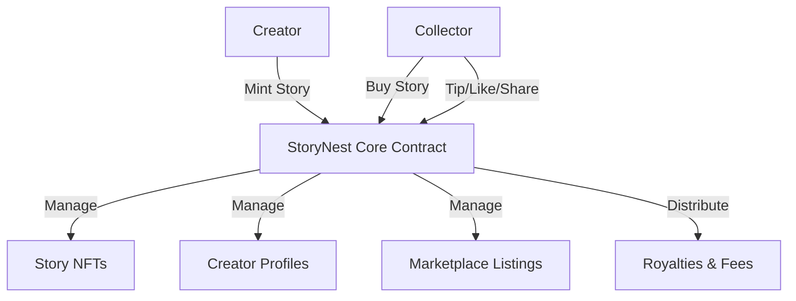

# StoryNest Animated Stories Platform

A decentralized platform for creating, sharing, and collecting animated stories as NFTs on the Stacks blockchain.

## Overview

StoryNest enables digital storytellers to mint their animated stories as NFTs with built-in royalty mechanisms and verifiable ownership. The platform creates a sustainable ecosystem where creators can monetize their work while collectors can directly support and own unique digital stories.

### Key Features

- Mint animated stories as NFTs with customizable royalties
- Creator profiles with reputation scoring
- Marketplace for buying and selling story NFTs
- Direct creator tipping system
- Social engagement features (likes and shares)
- Automated royalty distribution for secondary sales

## Architecture

The platform is built around a core smart contract that manages story NFTs, creator profiles, and marketplace functionality.



### Core Components

- Stories: NFTs containing animation metadata and ownership information
- Creator Profiles: On-chain records of creator information and reputation
- Marketplace: Facilitates buying and selling of story NFTs
- Reputation System: Tracks creator engagement and success

## Contract Documentation

### storynest-core.clar

The main contract handling all platform functionality.

#### Key Features

- Story NFT minting and management
- Creator profile registration and updates
- Marketplace operations
- Social engagement tracking
- Automated fee distribution

#### Access Control

- Story operations restricted to owners
- Creator profile updates restricted to profile owners
- Platform admin controls fee collection

## Getting Started

### Prerequisites

- Clarinet
- Stacks wallet
- STX tokens for transactions

### Basic Usage

1. Register as a creator:
```clarity
(contract-call? .storynest-core register-creator 
    "Creator Name" 
    "Bio information" 
    "profile-image-url")
```

2. Mint a story:
```clarity
(contract-call? .storynest-core mint-story 
    "Story Title" 
    "Description" 
    "animation-url" 
    "thumbnail-url" 
    u100 
    "category")
```

## Function Reference

### Creator Management

```clarity
(register-creator (name (string-utf8 100)) (bio (string-utf8 500)) (profile-image (string-utf8 256)))
(update-creator-profile (name (string-utf8 100)) (bio (string-utf8 500)) (profile-image (string-utf8 256)))
```

### Story Management

```clarity
(mint-story (title (string-utf8 100)) (description (string-utf8 500)) (animation-url (string-utf8 256)) (thumbnail-url (string-utf8 256)) (royalty-percent uint) (category (string-utf8 50)))
(transfer-story (story-id uint) (recipient principal))
```

### Marketplace Operations

```clarity
(list-story-for-sale (story-id uint) (price uint))
(cancel-listing (story-id uint))
(buy-story (story-id uint))
```

### Social Engagement

```clarity
(like-story (story-id uint))
(share-story (story-id uint))
(tip-creator (creator-principal principal) (amount uint))
```

## Development

### Testing

1. Clone the repository
2. Install Clarinet
3. Run tests:
```bash
clarinet test
```

### Local Development

1. Start Clarinet console:
```bash
clarinet console
```

2. Deploy contracts:
```bash
clarinet deploy
```

## Security Considerations

### Limitations

- Maximum royalty percentage: 30%
- Platform fee: 5%
- Creator reputation cannot be decreased

### Best Practices

1. Always verify transaction status
2. Check story ownership before operations
3. Verify marketplace listings before purchase
4. Ensure sufficient STX balance for transactions
5. Validate creator profiles before interactions